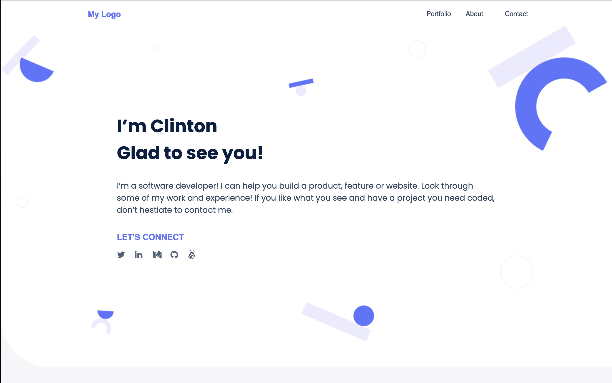

# Microverse Portfolio

[LIVE DEMO LINK](https://clintonjosephs.github.io/portfolio_website/)

We updated the protofolio project to implement the use of media queries for screen based css changes and to achieve Responsive Web Design. Making further use of Grid and Flexbox for layouts

## Built With

- HTML
- CSS
- HTML & CSS Linter

## Getting Started

**Please get your browser update. To get a local copy up and running follow these simple steps.**

Run the command below from the Terminal:

### navigate to your projects folder

### run git clone https://github.com/clintonjosephs/microverse_portfolio.git in your terminal

### run cd microverse_portfolio

### start index.html

## Authors

👤 **Author**

- GitHub: [@clintonjosephs](https://github.com/clintonjosephs)
- Twitter: [@clintonmbonu_](https://twitter.com/clintonmbonu_)
- LinkedIn: [LinkedIn](https://linkedin.com/in/clinton-mbonu)

## 🤝 Contributing

Contributions, issues, and feature requests are welcome!

Feel free to check the issues page.

## Show your support

Give a ⭐️ if you like this project!

## Acknowledgments

- Entire Microverse team
- My learning and coding partners

## 📝 License
This project is [MIT](LICENSE) licensed.
