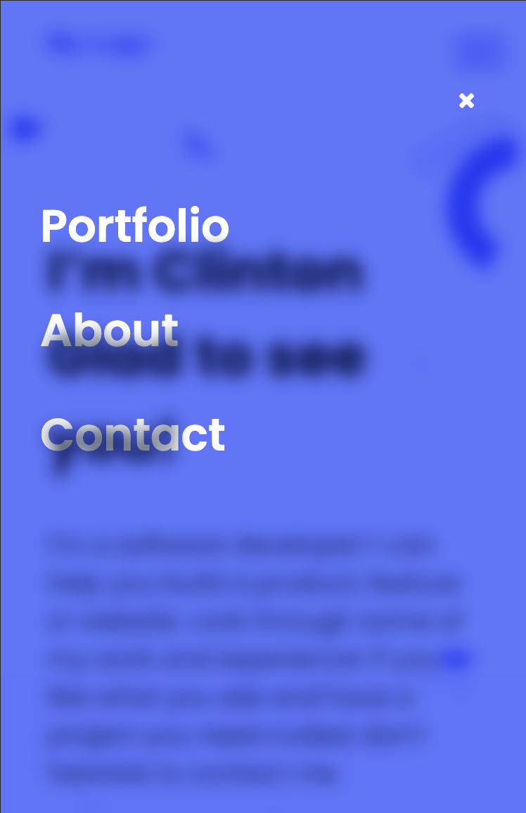

# My Portfolio

[LIVE DEMO LINK](https://clintonjosephs.github.io/portfolio_website/)

Portfolio website to show better a sneak peak on the things I can do to your project. Live demo link has been added using github pages to give you a tour of the project! 
Enjoy the swiftness of the mobile menu as you click on the navigation button while on mobile scree,
Happy surfing!

## Built With

- HTML
- CSS
- Javascript
- HTML & CSS & Javascript Linter

## Getting Started

**Please get your browser update. To get a local copy up and running follow these simple steps.**

Run the command below from the Terminal:

### navigate to your projects folder

### run git clone https://github.com/clintonjosephs/microverse_portfolio.git in your terminal

### run cd microverse_portfolio

### start index.html

## Authors

👤 **Author**

- GitHub: [@clintonjosephs](https://github.com/clintonjosephs)
- Twitter: [@clintonmbonu_](https://twitter.com/clintonmbonu_)
- LinkedIn: [LinkedIn](https://linkedin.com/in/clinton-mbonu)

## 🤝 Contributing

Contributions, issues, and feature requests are welcome!

Feel free to check the issues page.

## Show your support

Give a ⭐️ if you like this project!

## Acknowledgments

- Entire Microverse team
- My learning and coding partners

## 📝 License
This project is [MIT](LICENSE) licensed.
